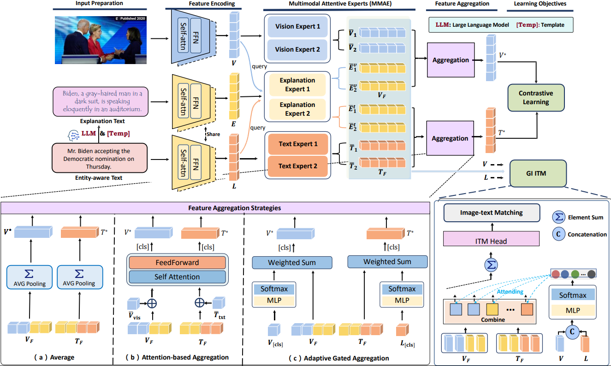
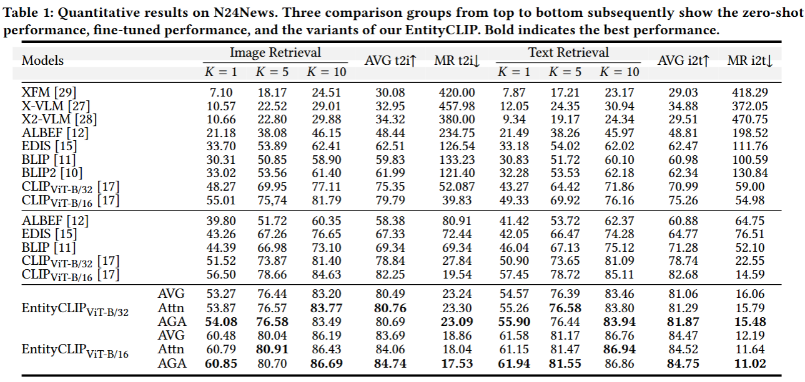
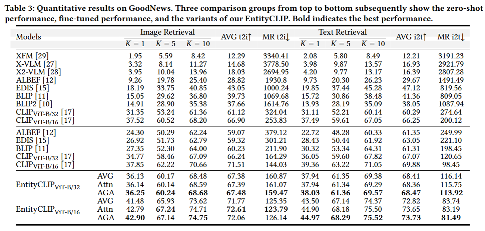
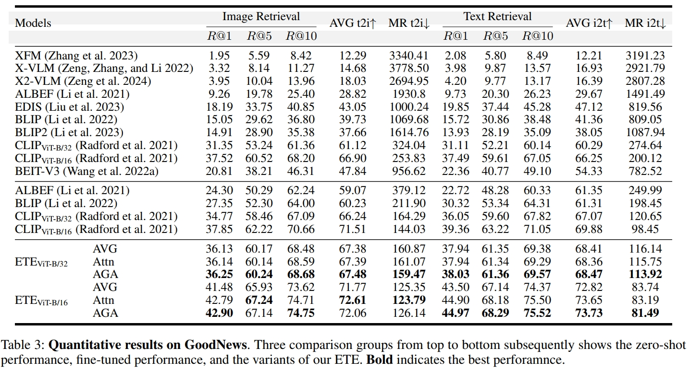
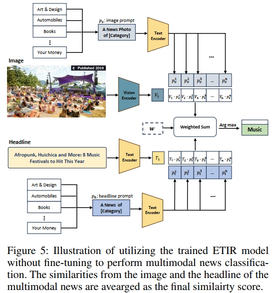
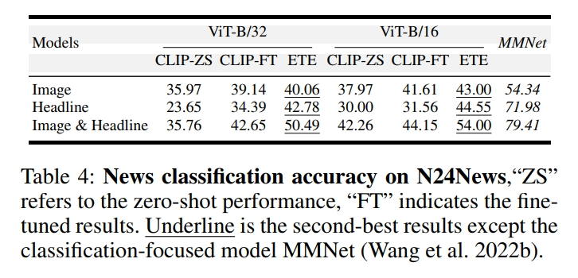
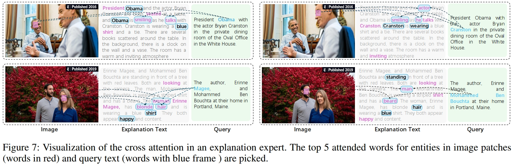
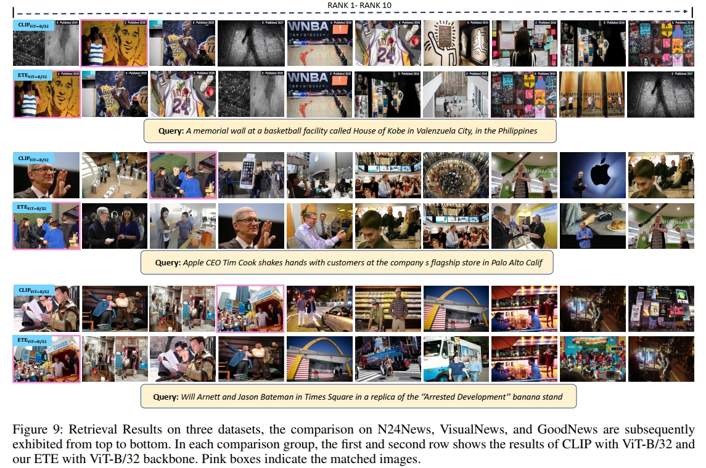

# Entity-Oriented Text-based Image Retrieval: A Baseline 

This is is a PyTorch implementation of the new task of Entity-oriented Text-based Image Retrieval introduced in this paper:

## Introduction
The Illustration of AINet:




## Environment Preparation 
The training code was mainly developed and tested with python 3.9, PyTorch 1.13, CUDA 12.4, and Ubuntu 20.04.
step 1: create virtual enviroment, recommend anaconda
``` bash
conda create -n ETE python=3.9
```
step 2: clone this repository
```bash
git clone https://github.com/wangyxxjtu/ETE.git
```
step 3: install the required dependencies:
``` bash
pip install -r requirements.txt
```


## Data Preparation
step 1: download our generated auxiliary explanation Text
```bash
pip install gdown
gdown https://drive.google.com/drive/folders/1kbwiZIATA8vsGYa23XS-u0WFZlR99grN?
```

step 2: download three evaluation dataset: N4News, VisualNews, and GoodNews:
``` bash
#N24News
gdown https://drive.google.com/file/d/1OS1fXwZ1Vsj70lEQajccyssxQRYp5X9D/view?

#VisualNews
download VisualNews in this page: https://www.cs.rice.edu/~vo9/visualnews/

#GoodNews
download GoodNews in this page: https://github.com/furkanbiten/GoodNews
```

step 3: organize three dataset in the following from
``` bash
N24News
    --imgs
    --news
        --CapDsc_mistral_train.json
        --CapDsc_mistral_dev.json
        --CapDsc_mistral_test.json
VisualNews
    --images
    --train.json
    --val.json
    --test.json
    --CapDsc_mistral_train.json
    --CapDsc_mistral_val.json
    --CapDsc_mistral_test.json
GoodNews
    --images
    --new_goodnews_capim_train.json
    --new_goodnews_capim_val.json
    --new_goodnews_capim_test.json
    --/train_cap_individual/
        --New_Corr_CapDsc_mistral_train.json
        --New_Corr_CapDsc_mistral_val.json
        --New_Corr_CapDsc_mistral_test.json
```

## training and test
option 1
``` bash
#train
CUDA_VISIBLE_DEVICES=0 python main.py --dataset N24News  --output checkpoints --expert_config '444' --beta 0.1  --batch_size 192

#test
CUDA_VISIBLE_DEVICES=$GPU python eval.py --dataset N24News  --output checkpoints --expert_config '444' --beta 0.1
```

option 2: specify the details in run.sh and run:
``` bash
sh run.sh
```

## Experiment results
### Retrieval Results on N24News, VisualNews and GoodNews







### Evaluation on Multimodal News Classification

Evaluation setup:



Results:



### Visualization results
Attention Visualization in Explanation expert:



Retrieval results:




## Acknowledgement
This code is built on the top of CLIP: https://github.com/openai/CLIP Thank the authors' contribution. 
